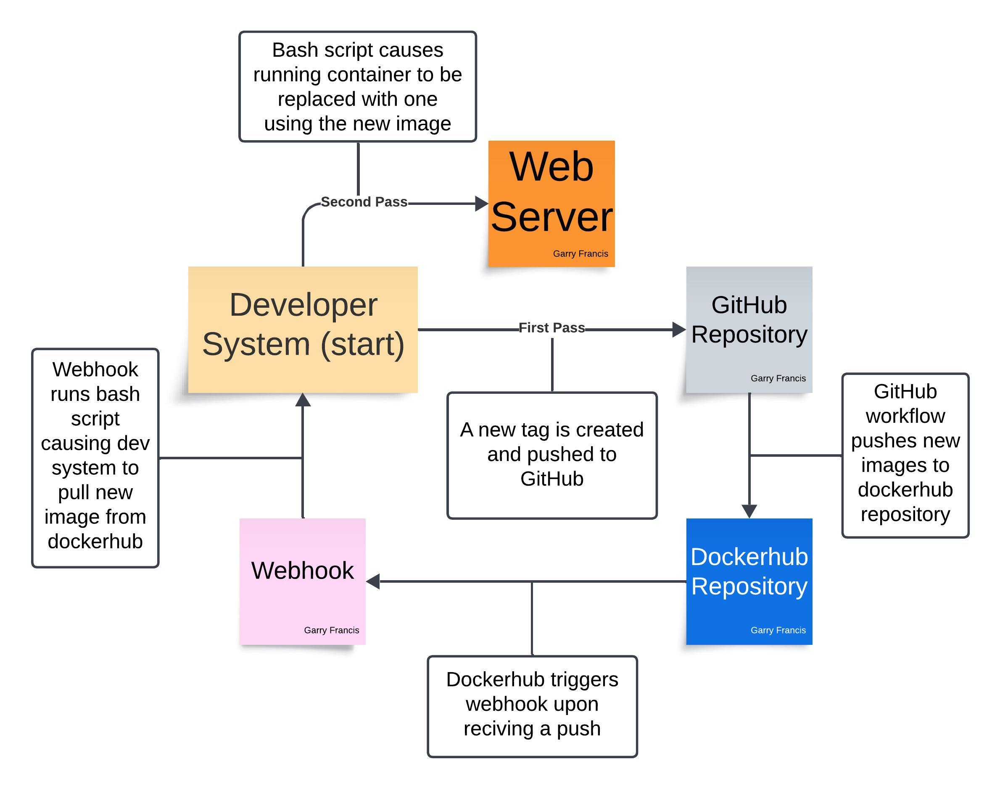

# Project 5

This is a continuation on the contiuous integration that was done in Project 4. This time we will be doing continuous deployment, which will allow changes made to the code to be automatically applied to the user end.



## Semantic Versioning

Semantic versioning is a system designed to show with version numbers what has changed in each new update for a piece of software. It uses a three-part version number format MAJOR.MINOR.PATCH, where:

- Major

Is increased when there are changes made that will require users to make adjustments to their code because of significant updates or changes in the software.

- Minor

Is increased when there are new features added in a way that is backward-compatible with previous versions. This means that the new version provides additional functionality without breaking existing features.

- Patch

Is increased when backward-compatible bug fixes are introduced. These changes do not affect the software's functionality but improve preformance or resolve other issues.

In Project 4 (CI) we tagged all of our images with `latest`, meaning that none of the previous versions have been saved. This time, we will be using semantic versioning by using git tagging and updating our github action to use metadata to generate tags for our images.

### Git Tagging

First we will want to begin tagging our commits using `git tag`. Just the command `git tag` will show you your existing git tags, of which we have none. Make a tag with the command `git tag -am [tagname] "[description"]` and then prepare a commit. Once you have a commit ready run the command `git push origin [tagname]` and should have pushed the tag to your GitHub repository. To check if it worked go to your repo and click on the button showing main branch, then click the tags tab and you should see your tagged commit there, forever preserved in that state.

### Workflow Updates

Now we are going to change our GitHub action workflow to do this automatically for us. The action previously looked like this:

```yml
name: docker_build_push # name of the action

on:
  push:
    branches: # what causes the action to start (a push to the main branch)
      - main

jobs:
  build-push:
    runs-on: ubuntu-latest

    steps:
      - name: Checkout code
        uses: actions/checkout@v2 # checks the code in the repository

      - name: Log in to DockerHub
        uses: docker/login-action@v2 # uses the username and token secrets to login to dockerhub
        with:
          username: ${{ secrets.DOCKER_USERNAME }}
          password: ${{ secrets.DOCKER_TOKEN }}

      - name: Build and push Docker image
        uses: docker/build-push-action@v6.10.0
        with:
          context: [directory that has your Dockerfile]
          push: true
          tags: [your-username]/[your-repository-name]:latest  # pushes the image to dockerhub repository
```

We are going to be changing the push trigger, adding a new step, and changing the last line to use multiple tags. First I am going to put the updated workflow in full form, and then break down all the new parts:

```yml
name: docker_build_push

on:
  push:
    tags:
      - 'v*'  # This will trigger the action for tags that start with 'v'

jobs:
  build-push:
    runs-on: ubuntu-latest

    steps:
      - name: Checkout code
        uses: actions/checkout@v2 # checks the code in the repository

      - name: Log in to DockerHub
        uses: docker/login-action@v3 # uses the username and token secrets to login to dockerhub
        with:
          username: ${{ secrets.DOCKER_USERNAME }}
          password: ${{ secrets.DOCKER_TOKEN }}

      - name: Set up Docker tags
        id: meta
        uses: docker/metadata-action@v5
        with:
          images: [your-username]/[your-repository-name]
          tags: |
            latest
            type=semver,pattern={{version}} # This uses the full version (e.g., v1.2.3)
            type=semver,pattern={{major}} # This extracts the major version (e.g., v1)
            type=semver,pattern={{major}}.{{minor}} # This extracts the major and minor version (e.g., v1.2)

      - name: Build and push Docker image
        uses: docker/build-push-action@v6.10.0 # uses other action
        with:
          context: [directory that has your Dockerfile]
          push: true
          tags: ${{ steps.meta.outputs.tags }} # Uses the tags generated by the metadata action
          labels: ${{ steps.meta.outputs.labels }}
```

Now, the individual changes:

```yml
on:
  push:
    tags:
      - 'v*'  # This will trigger the action for tags that start with 'v'
```

This part used to cause the workflow to run every time a push was made to the main branch. Now it will only cause the action to activate when a new tag starting with the letter v is pushed instead. This is to prevent tons of pushes where nothing changes from being made.

```yml
- name: Set up Docker tags
        id: meta
        uses: docker/metadata-action@v5
        with:
          images: [your-username]/[your-repository-name]
          tags: |
            latest
            type=semver,pattern={{version}} # This uses the full version (e.g., v1.2.3)
            type=semver,pattern={{major}} # This extracts the major version (e.g., v1)
            type=semver,pattern={{major}}.{{minor}} # This extracts the major and minor version (e.g., v1.2)
```

This new step of the workflow, called `meta`, creates all the tags that are going to be assigned to your dockerhub repository. Using the github metadata about your tags, and the semantic versioning pattern detection available in the docker metadata actions, it will make four tags: Latest, Major, Major.Minor, and Major.Minor.Patch.

```yml
- name: Build and push Docker image
        uses: docker/build-push-action@v6.10.0 # uses other action
        with:
          context: [directory that has your Dockerfile]
          push: true
          tags: ${{ steps.meta.outputs.tags }} # Uses the tags generated by the metadata action
          labels: ${{ steps.meta.outputs.labels }}
```

Before this part of the workflow would push the dockerfile with only the tag `latest` every time it was used, the last two lines change that. The `tags:` line now specifies the tags for the docker images, pulled from the newly added `meta` step. The new `labels:` line gives metadata lebels to the docker images, labels being values that provide aditional information about the images.

Once your workflow has been updated, make a commit and tag it to see if it works. Push the tag to your GitHub repo and watch the action status. Everything should work as intended and you should now have three new dockerhub images (and latest) on your dockerhub repo.

## Deployment

Now that we have our semantic versioning all automated, we can begin our continuous deployment. We are going to have a AWS EC2 insance Running on a t2.medium using Ubuntu 24.04 with the public ip 34.192.160.4, and it will be hosting our `angular-site` with our container made in project 4. This means you will have to go through the process of setting up docker on an AWS instance. I have gone through this process in project 4 [(README-CI.md)](https://github.com/WSU-kduncan/f24cicd-RecycledDrit/blob/main/Project4/README-CI.md), but here is what to do as a reminder:

1. Run `sudo apt update` and `sudo apt install curl apt-transport-https ca-certificates software-properties-common` to make sure your instance is up-to-date.

2. Run the commands `curl -fsSL https://download.docker.com/linux/ubuntu/gpg | sudo gpg --dearmor -o /usr/share/keyrings/docker-archive-keyring.gpg` and `echo "deb [arch=$(dpkg --print-architecture) signed-by=/usr/share/keyrings/docker-archive-keyring.gpg] https://download.docker.com/linux/ubuntu $(lsb_release -cs) stable" | sudo tee /etc/apt/sources.list.d/docker.list > /dev/null` to prepare downloads form the docker community edition repository.

3. Run `sudo apt update` again to make sure updates took effect.

4. Run `sudo apt install docker-ce` to install docker community edition.

5. Run `sudo usermod -aG docker [username]` to add your user to the docker group.

Now you should have docker installed on your instance and after loging in with `docker login` you should be able to pull the angular-site image from your dockerhub repo using `docker pull [your-username]/[your-repository-name]:[what tag you want]` Make sure that your instance is able to run the container before we move on to the next step

### Bash Script

In order to make a way for the angular site to be updated every time we make a new tag. There is no built-in way for us to do this, so we're going to have to write a bash script real quick. Make a new directory called `deployment` and make this script file in there:

- `#!/bin/bash`

The shebang line. Tells the system that this is bash and should be run like bash.

- `docker stop [container-name]`

Stops a running docker container with the specified name.

- `docker rm [container-name]`

Removes a stopped docker container with the specified name.

- `docker pull [your-username]/[your-repository-name]:latest`

Pulls your latest version of the image from docker hub so it can be used to make a container.

- `docker run -d --name [container-name] --restart always -p 4200:4200 [your-username]/[your-repository-name]:[what tag you want]`

Creates a container in detached mode (`-d`) using your image and gives it the container name that the script will delete next time it is run (`--name`). Also specifies that the container will allways restart itself if the server goes down (`--restart always`) and what ports it will run on (`-p 4200:4200`).

Run the script twice to make sure it works, once to make the named container, and the second time to make sure it gets replaced. Also be sure to run `chmod a+x [scriptname].sh` to make sure webhook will have execute permissions later.

### Webhooks

Now just having the script won't be enough, because it cant run automaticaly by itself. To make the script run on a trigger we will need a new tool called a webhook. A webhook is an HTTP callback that sends real-time notifications about specific events. When an event occurs, the source application sends an HTTP request to a configured URL with event data. Using a webhook we will be able to cause the bash script to run when a tag push is made to one of our repositories.

To download webhook onto your instance run `sudo apt install webhook` Once this is done, if you check the status of webhook with `systemctl` you will see it has an unmet condition. That condition being that `/etc/webhook.conf` does not exist, but we won't worry about that yet. For now we are just going set up the webhook what we will later automate. Make a new "hook definition" file in `deployment` called `hooks.json` and write the following:

```json
[
  {
    "id": "redeploy-webhook",
    "execute-command": "/path/to/script/[scriptname].sh",
    "command-working-directory": "/path/to/deployment"
  }
]
```

(The spacing matters, this is JSON)

The first line sets the id of the webhook, which will be used to call it later. The second line is what command the webhook will run when it is triggered, It has the path to our bash script to tell it that is the command that should be run. And the third line is the working directory that command will be executed in, that being the `deployment` directory that our script exists in.

Now when you run the command `webhook -hooks /path/to/hooks.json -verbose` you will see the webhook come online and wait for a trigger. You can cause a trigger by going to http://[your-public-ip]:9000/hooks/redeploy-webhook which will activate the program, run the script, and update your docker container. When you have your webhook listening and you cause a trigger at the http address, you should see webhook reporting that it recived the HTTP request and triggered successfuly, along with the docker image being downloaded to your instance.

But this still isn't automated, to do that we are going to have to go back to dockerhub (You could do something similar with github but I think using dockerhub for this situation is better i.e. the script won't be called before the tags can be pushed) and look at the "Webhooks" tab in your repository. Click in and you will see two boxes asking for a name and a url. Make the name whatever you want and make the url http://[your-public-ip]:9000/hooks/redeploy-webhook then hit the plus on the right. Now dockerhub will make the trigger with the webhook url every time a push is made to the repository.

Now comming back around to that unmet condition webhooks had, we are going to modify the file at `/usr/lib/systemd/system/webhook.service` to make some corrections about how it thinks our files are stored (You will need to use `sudo` to edit the file). The file should start out looking like this:

```
[Unit]
Description=Small server for creating HTTP endpoints (hooks)
Documentation=https://github.com/adnanh/webhook/
ConditionPathExists=/etc/webhook.conf

[Service]
ExecStart=/usr/bin/webhook -nopanic -hooks /etc/webhook.conf

[Install]
WantedBy=multi-user.target
```

The only lines we care about here are `ConditionPathExists=/etc/webhook.conf` and `ExecStart=/usr/bin/webhook -nopanic -hooks /etc/webhook.conf` The first one is what is giving the unmet condition message, because by default webhook expects you to have your hooks in `/etc/webhook.conf`, which we don't. So change that part of the line to the path to your `hooks.json` file. It's the same thing with the next line, change the default path to our custom one.

Restart webhooks by running `sudo systemctl daemon-reload` for the service file changes and then `sudo systemctl restart webhooks.service` for your new definition file to make sure our changes took effect.

Now, when you push a new tag to your GitHub repository it will automatically cause your docker images to be pushed to dockerhub, re-make your container using the new image, and update the active web-server all by itself. The logs for using webhook this way can be seen by running `journalctl -u webhooks.service`

### Links

[My Dockerhub Repo](https://hub.docker.com/r/recycleddirt/francis-ceg3120/tags)
[refresh.sh](https://github.com/WSU-kduncan/f24cicd-RecycledDrit/blob/main/deployment/refresh.sh)
[hooks.json](https://github.com/WSU-kduncan/f24cicd-RecycledDrit/blob/main/deployment/hooks.json)
[Webhook.service](https://github.com/WSU-kduncan/f24cicd-RecycledDrit/blob/main/deployment/webhook.service-copy)
