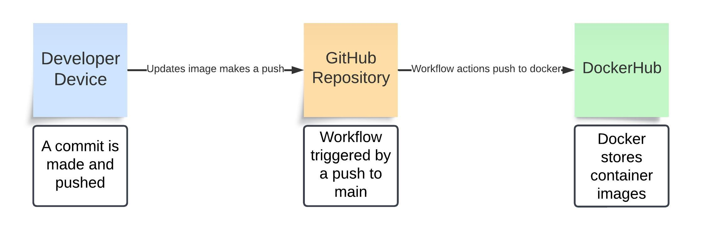

# Project 4

In this project we will be learning how to use containers in Docker and how to automate the process of updating what we make on DockerHub using GitHub Actions, which is called continuous integration.



## Docker

Docker is a cloud-based repository service that allows developers to share, store, and manage container images. A container being an idependent section of a system that contains everything needed to run a piece of software.

To install docker for ubuntu, first make sure your ubnutu isntance is up to date using `sudo apt update` and `sudo apt install curl apt-transport-https ca-certificates software-properties-common`. Then, because we are using the community edition of docker for ubuntu, type `curl -fsSL https://download.docker.com/linux/ubuntu/gpg | sudo gpg --dearmor -o /usr/share/keyrings/docker-archive-keyring.gpg` and `echo "deb [arch=$(dpkg --print-architecture) signed-by=/usr/share/keyrings/docker-archive-keyring.gpg] https://download.docker.com/linux/ubuntu $(lsb_release -cs) stable" | sudo tee /etc/apt/sources.list.d/docker.list > /dev/null` to allow downloads from that repository. Finally, run `sudo apt update` again and then type `sudo apt install docker-ce` into which will install the docker application.

Doing this will allow you to use Docker commands inside ubuntu. However, your user might not have the permissions to use docker commands. You could work around this just by putting `sudo` in front of every command discussed from this point on, but instead you can add yourself to the docker group using the command `sudo usermod -aG docker [username]` which will give you access to the commands after you leave and re-enter your instance.

## Containerizing Applications

To begin creating your container, you first need a container image.An image is a set of prewritten instructions detailing code of your application, its dependencies, configuration files, etc that will be used during the creation of your image.

You could use a pre-made image from DockerHub, but for this we are going to be making our own. Create a file called `Dockerfile` and write the following lines:


- `FROM node:18-bullseye`

This line selects what is called a "base image". A base image is an existing image that will function as your image's foundation. It will include thing like the opperating system and runtime environments.

- `WORKDIR /usr/src/app/angular-site`

This line decides the working directory inside the contianer. The directory shown is where most ubuntu apps go by default, but sence node doesn't have this directory it will be created automatically.

- `COPY angular-site/wsu-hw-ng-main /usr/src/app/angular-site`

This copies the contents of our angular app and places them in same working directory we decided on earlier. This will make it so our container actually has our app's files and they are in the proper place to be used.

- `RUN npm install -g @angular/cli `

This installs the angular command line interface, allowing the use of the `ng` command. the `-g` flag means it will be installed globaly, letting the `ng` command work anywhere in the container.

- `RUN npm install `

This command installs the dependencies listed in the `package.json` file of our app. Those being packages that are needed for the app to run correctly.

- `RUN ng build`

This line will build the application and compile it into an output directory to be received by a webserver.

- `CMD ["ng", "serve", "--host", "0.0.0.0"]`

This line is a command that is set to run when the container is started. The command itself is one that will start the angular development server and allow it to be accessed from outside the container.


Once you have completed this file, you will need to build the image. But before you can do that you have to set up your dockerhub account.

### DockerHub

Dockerhub is a website that is used to store and share docker images. In order to use dockerhub we will need an account. Got to [dockerhub](https://hub.docker.com/explore) and create an account. Then click on repositories at the top of the page and click the create a repository button. Give it a name, decide whether it is private or public, and then create.

Once you have done that go back to your instance and type `docker login` where you will be given a url and a code. Go to the url and type the code you were given and you will connect your instance to dockerhub, along with having a token generated for you that will let you login again without doing this.

Now that you are connected to dockerhub and have a repository, go to the directory with your dockerfile and type the command `docker build -t [your-username]/[your-repository-name]:[tag]` while filling in your username, the name of your repository, and the tag that will be used to identify your image. Your image is now avalible on your machine to be used by you immediately and on your dockerhub repo for anyone to download (or only for you if its private). To make this image into a container type the command `docker run -p 4200:4200 [image-name]` where `-p 4200:4200` means to use port 4200 to access it from the browser at http://localhost:4200 if being run on your device or at http://[instance public ip]:4200 if you are hosting it on an instance. After the application is completely set up (it will tell you) hit ctrl+c three times to exit the app and go look at it at your http url.

## GitHub Actions

GitHub Actions are a feature of GitHub that allows you to automate certain parts of your development. It uses custom created "workflows" that can be triggered by events like pushes, pulls, or errors.

First, you will want to return to dockerhub and go to your account settings and click on Personal Access Tokens. These act as a replacement for your password in certain situations (like when you use `docker login`). Click generate new token, give it a description, set its expiration date, and choose the access permisions that someone logging in with this token (GitHub actions in this case) will have. Make the description and expiration whatever you want but set the permissions to Read & Write.

Next you will want to set up some GitHub secrets. GitHub secrets are used to store information like that token you just made and use it to login to services for you. To make a secret go to the repository you want to make a secret for and go to the settings. Under security you will see secrets and variables, select that and then the actions section that will appear. You will new see repository secrets, make two repository secrets called DOCKER_USERNAME AND DOCKER_TOKEN and put their respective values in the secret.

Now that you have your secrets, its time to set up an workflow that uses them. In the root directory of your GitHub repository make a directory called `.github` and inside of that directory make another called `workflows`. This is where GitHub will check for any actions that your repository is going to use. Make a `.yml` file and enter this:

```yml
name: docker_build_push # name of the action

on:
  push:
    branches: # what causes the action to start (a push to the main branch)
      - main

jobs:
  build-push:
    runs-on: ubuntu-latest

    steps:
      - name: Checkout code
        uses: actions/checkout@v2 # checks the code in the repository

      - name: Log in to DockerHub
        uses: docker/login-action@v2 # uses the username and token secrets to login to dockerhub
        with:
          username: ${{ secrets.DOCKER_USERNAME }}
          password: ${{ secrets.DOCKER_TOKEN }}

      - name: Build and push Docker image
        uses: docker/build-push-action@v6.10.0
        with:
          context: [directory that has your Dockerfile]
          push: true
          tags: [your-username]/[your-repository-name]:latest  # pushes the image to dockerhub repository
```

This workflow says that when a push is made to the main branch a job called `build-push` will run using the latest version of ubuntu. This job will use the action `actions/checkout@v2` to check the code from the repository, then it will login to DockerHub using the action `docker/login-action@v2` along with your DOCKER_USERNAME and DOCKER_TOKEN secrets. Finally, using the action `docker/build-push-action@v6.10.0` it will use your Dockerfile to build the image and then push it to your DockerHub repository. And now it will do this every time you make a push to your main repo branch.

### Links

[My Dockerhub Repo](https://hub.docker.com/r/recycleddirt/francis-ceg3120)
[How to Use Docker](https://www.cherryservers.com/blog/install-docker-ubuntu)
[GitHub Action Commands](https://docs.docker.com/build/ci/github-actions/)
[Creating an Angular App in Docker](https://dev.to/rodrigokamada/creating-and-running-an-angular-application-in-a-docker-container-40mk)
